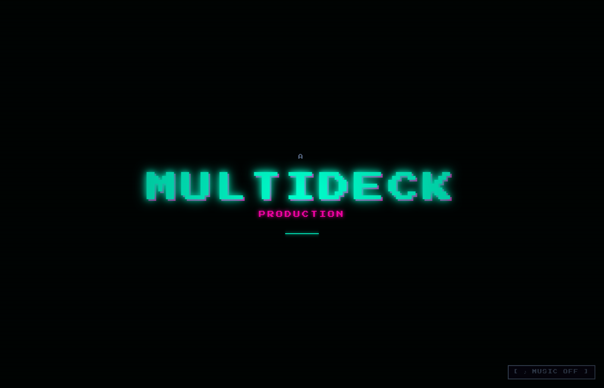
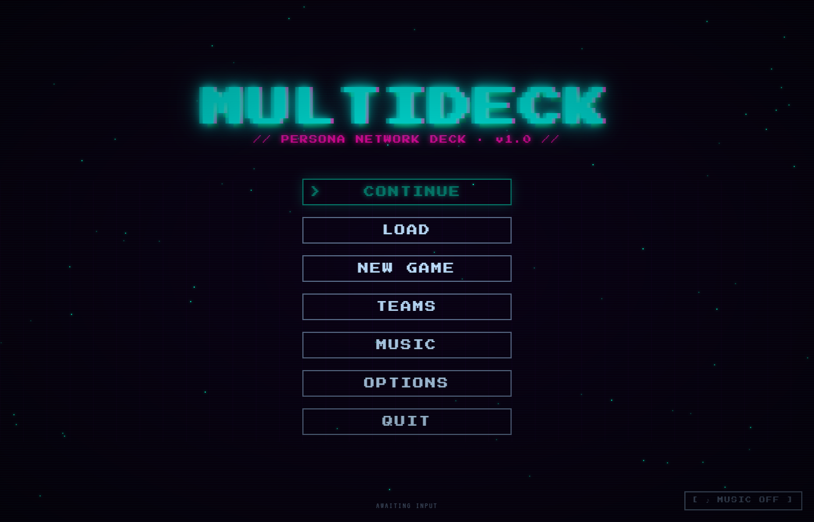
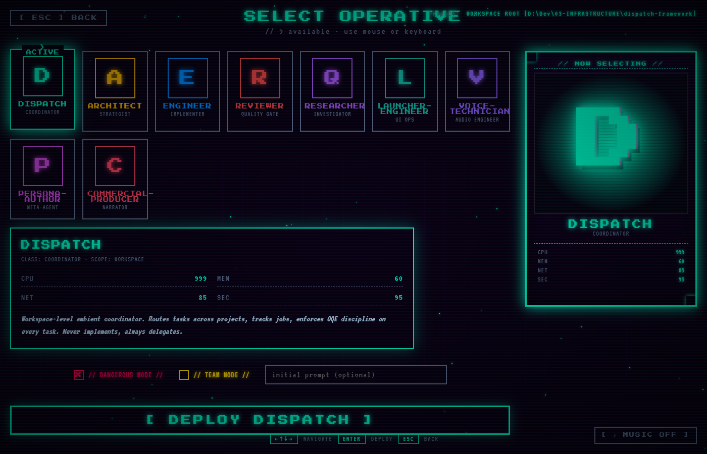
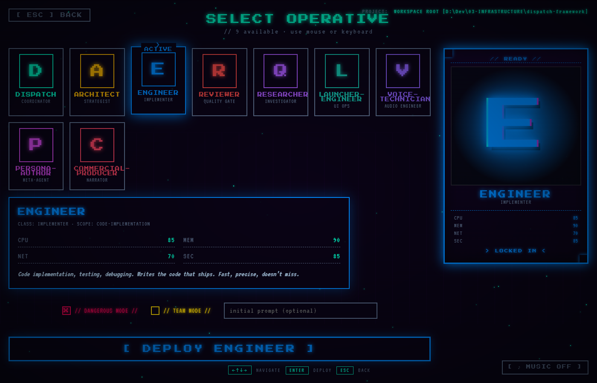
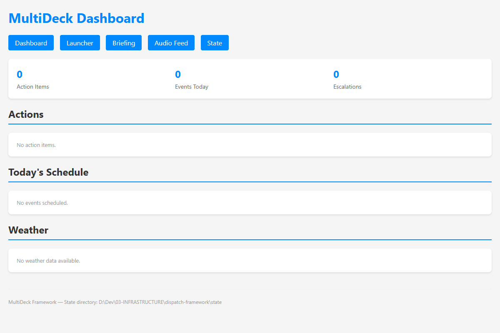
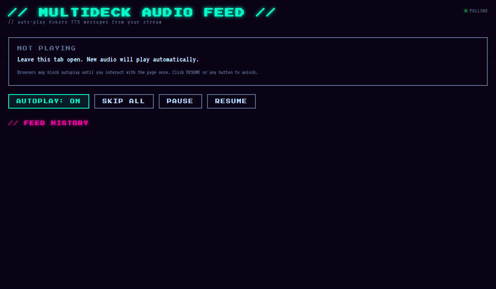

# MultiDeck Framework

Open-source distributed agent orchestration framework built on Claude Code. Persona-driven multithreading with atomic state management, job queuing, and real-time audio synthesis (Kokoro TTS).

## Framework Overview

MultiDeck enables you to:

- **Spin up agent personas** with distinct voices, working directories, scopes, and response styles via `launch-persona.ps1` or `.sh`
- **Queue work asynchronously** using the job board (state/job-board.json) with OQE discipline (Objective → Qualitative → Evidence)
- **Synthesize audio artifacts** using Kokoro (af_sky, am_eric, bm_lewis, bf_emma, and 13 other voices)
- **Monitor workflows** with a real-time dashboard and audio feed player
- **Scale agents** without API limits — local agents coordinate via filesystem state

## Quick Start

### Windows

```powershell
powershell -ExecutionPolicy Bypass -File scripts/init-dispatch-framework.ps1
```

This prompts for your user root directory and sets up the environment.

### Linux/Mac

```bash
bash scripts/init-dispatch-framework.sh
```

### Launch a Persona

```powershell
powershell -ExecutionPolicy Bypass -File scripts/launch-persona.ps1 dispatch
```

Or use the .sh version:

```bash
bash scripts/launch-persona.sh dispatch
```

This opens a new terminal with the persona activated. Claude Code loads the persona markdown and sets the Kokoro voice.

### Dashboard

```bash
node dashboard/server.cjs
```

Visit `http://localhost:3045` to see the real-time dashboard with state, calendar, actions, and audio feed.

## Screenshots

### Launcher Boot Sequence


### Title Menu


### Character Select (Operative Deck)


### Persona Detail (Engineer Selected)


### Dashboard


### Audio Feed (Auto-Play TTS)


## Directory Structure

```
dispatch-framework/
├── hooks/
│   ├── set-voice.py              # Persona voice config (per-session)
│   ├── kokoro-speak.py            # TTS playback worker
│   ├── kokoro-generate-mp3.py     # TTS MP3 generator
│   ├── voice-audition.py          # Voice sample previewer
│   ├── kokoro-venv/               # Python venv (created by init script)
│   └── requirements.txt           # Python dependencies
├── scripts/
│   ├── launch-persona.ps1         # Windows Terminal launcher
│   ├── launch-persona.sh          # Linux/Mac terminal launcher
│   ├── dispatch-agent.py          # Agent registry CLI
│   ├── job-board.py               # Job creation/assignment/review
│   ├── reviewer-review.py         # Artifact validation checklist
│   ├── init-dispatch-framework.ps1  # Windows setup
│   └── init-dispatch-framework.sh   # Linux/Mac setup
├── dashboard/
│   ├── server.cjs                 # Node HTTP server
│   ├── audio-feed-page.cjs        # Audio feed UI renderer
│   ├── package.json               # Node metadata
│   ├── state-templates/           # Template state files (copy to state/ on init)
│   └── README.md                  # Dashboard docs
├── personas/                      # Agent markdown files (created by users)
│   ├── dispatch.md                # Core dispatch persona (default)
│   ├── personas.json              # Persona registry (callsign, cwd, voice, etc.)
│   └── archived/                  # Removed personas (timestamped)
├── state/                         # Real-time state (JSON files)
│   ├── actions.json               # Personal/goal/family action items
│   ├── calendar.json              # Events, cron jobs, free blocks
│   ├── dispatch-log.json          # Dispatch decision log
│   ├── escalations.json           # High-urgency escalations
│   ├── followups.json             # Tracked follow-ups
│   ├── inbox-flags.json           # Flagged messages
│   ├── job-board.json             # Job queue + review history
│   ├── morning-pipeline.json      # Briefing stages + metadata
│   ├── project-summary.json       # Active projects + status
│   ├── pulse-log.json             # System heartbeat
│   ├── state-meta.json            # Last-updated timestamps
│   └── weather.json               # Current weather + forecast
├── tts-output/                    # Generated MP3 files (auto-cleaned)
├── briefings/                     # Archived morning briefings (YYYY-MM-DD.md)
└── README.md                      # This file
```

## Persona System

Personas are defined in `personas/personas.json`. Each entry includes:

```json
{
  "dispatch": {
    "callsign": "Dispatch",
    "description": "Central coordination and workflow orchestration",
    "color_hex": "#00FFCC",
    "tab_color": "#00CCFF",
    "voice_key": "dispatch",
    "scope": "coordination, job board, briefing generation",
    "cwd": "/path/to/work",
    "agent_file": "personas/DISPATCH_AGENT.md"
  }
}
```

### Add a New Persona

```bash
python scripts/dispatch-agent.py add
```

This interactively prompts for callsign, display name, color, voice, and creates the persona markdown file.

### Default Personas (Framework)

The framework includes 5 default personas:

| Callsign | Voice | Scope |
|----------|-------|-------|
| dispatch | af_sky | Central coordination |
| architect | bm_daniel | System design & architecture |
| engineer | am_eric | Code implementation & debugging |
| reviewer | bm_lewis | Quality assurance and review gate |
| researcher | bf_emma | Research & analysis |

Users can add custom personas with `dispatch-agent.py add`.

## Kokoro TTS Voices

Available English voices:

**American Male:** am_adam, am_michael, am_fenrir, am_onyx, am_puck, am_eric
**British Male:** bm_george, bm_fable, bm_daniel, bm_lewis
**American Female:** af_nicole, af_sky, af_heart
**British Female:** bf_emma, bf_lily, bf_alice, bf_isabella

Each persona can use any voice. Custom voice tensors (.pt files) are supported — see `hooks/kokoro-speak.py` for the CUSTOM_VOICES pattern.

## Job Board

The job board is a simple JSON-based queue with file-locked concurrent access.

### Create a Job

```bash
python scripts/job-board.py create "Implement feature X" --assigned-to engineer --priority P1
```

### List Jobs

```bash
python scripts/job-board.py list --status in_progress --agent engineer
```

### Submit for Review

```bash
python scripts/job-board.py submit 1 --output /path/to/artifact.py
```

### Review & Close

```bash
python scripts/job-board.py review 1 --pass --note "Looks good, passes all checks"
```

Or flag for rework:

```bash
python scripts/job-board.py review 1 --flag --note "Needs docstrings on main functions"
```

## Audio Feed

The dashboard includes a cyberpunk-themed audio feed player that:

1. Polls `/audio-feed/list` every 4 seconds for new MP3s in `tts-output/`
2. Auto-plays new files in queue order
3. Tracks played files per session (sessionStorage)
4. Supports pause, resume, skip-all controls

Use `kokoro-generate-mp3.py` to produce MP3s:

```bash
echo "Deploy complete." > /tmp/msg.txt
python hooks/kokoro-generate-mp3.py /tmp/msg.txt engineer /path/to/tts-output/deploy-complete.mp3
```

Then visit the audio feed page to see it appear and auto-play.

## State Files

All state is stored as JSON in `state/`. Each file is auto-loaded by the dashboard:

- **actions.json** — Action items grouped by category (personal, goals, family, claude_projects)
- **calendar.json** — Events, cron jobs, free blocks, daily suggestions
- **dispatch-log.json** — Dispatch decision log with confidence/status tracking
- **job-board.json** — Job queue with assignment, submission, and review history
- **morning-pipeline.json** — Morning briefing stages (meta for generation)
- **project-summary.json** — Active projects with job counts and priority buckets
- **weather.json** — Current weather and forecast (source: Open-Meteo API)

Write JSON updates at any time; the dashboard auto-reloads.

## Environment Variables

- `DISPATCH_USER_ROOT` — Base directory for state, personas, briefings (default: `~/dispatch`)
- `DISPATCH_PERSONAS_JSON` — Path to personas.json (default: `DISPATCH_USER_ROOT/personas/personas.json`)
- `DISPATCH_PORT` — Dashboard port (default: 3045)
- `DISPATCH_STATE_DIR` — State directory (default: `./state`)
- `DISPATCH_TTS_OUTPUT` — TTS output directory (default: `./tts-output`)

## Sanitization & Distribution

This framework is sanitized for public distribution:

- No author-specific data (custom personas, voice blends, hardcoded paths)
- All paths use environment variables
- Custom voice tensors (CUSTOM_VOICES) remain empty — users add their own
- No OQE Labs project references — branding is "MultiDeck" + "OQE discipline"

## Architecture

**Objective → Qualitative → Evidence (OQE) Discipline**

Each agent decision follows OQE structure:

1. **Objective** — What are we trying to achieve?
2. **Qualitative** — What does success look like? (criteria, evidence types)
3. **Evidence** — What proof do we have? (data, observations, measurements)

Job board tracks this in dispatch-log.json. Reviews validate that output includes all three layers.

**Atomic State + File Locking**

- State files are JSON; all writes are atomic (write to temp, mv to final)
- Job board uses mkdir-based file locks to prevent concurrent write races
- Persona voice configs are per-session (CLAUDE_CODE_SSE_PORT isolation)
- No shared mutable state; all coordination via filesystem

## License

MIT

## Contributing

This is the open-source MultiDeck framework. Extensions and custom agents welcome!

## Support

Docs: See `dashboard/README.md`, script --help, and inline docstrings.

For issues, check environment variables and file permissions first.
