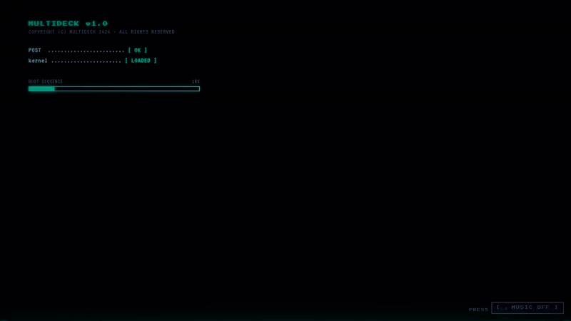
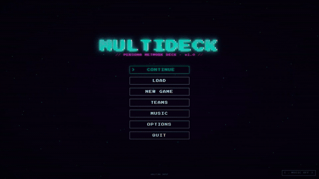
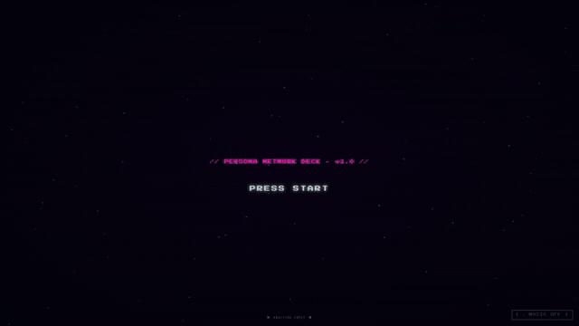
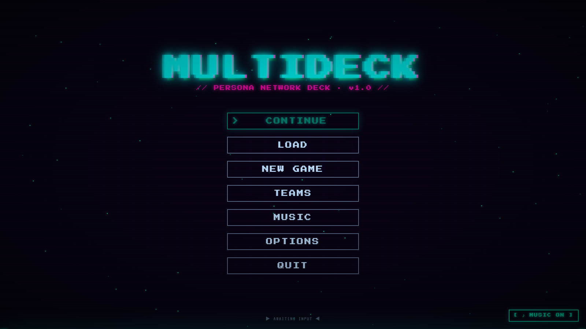
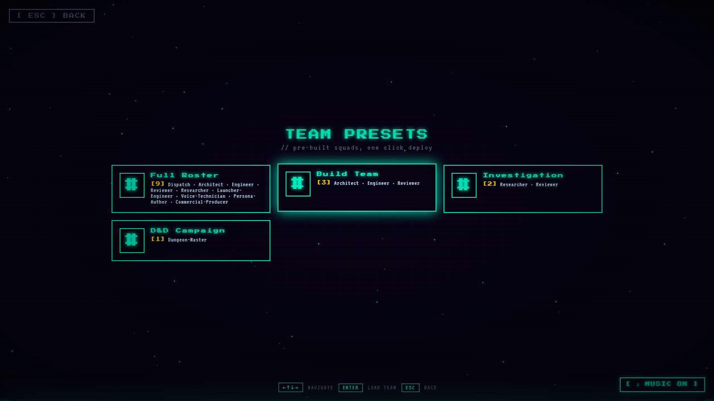

# MultiDeck

**A multi-agent orchestration framework for Claude Code that looks like a video game title screen. On purpose.**

Multiple AI operatives. Each with their own voice. One launcher. You pick your team from a character-select screen, hit DEPLOY, and real Claude Code sessions spin up in color-coded terminal tabs, each with its own persona, scope, and synthesized voice. A job board tracks the work. A quality gate reviews it. An audio feed plays their reports out loud so you can walk away from the keyboard and just listen.

It runs entirely local. Zero API cost with a Claude Code CLI membership. Fork it, add your own operatives, your own voices, your own background music. Make it yours.



### Watch: How Do You Claude?



[Watch the full 40-second spot](https://github.com/cmc3bear/claude-multideck-persona-launcher/raw/main/docs/media/how-do-you-claude.mp4)

*Vanilla Claude Code vs Claude Code inside MultiDeck. Same tool, different deck.*

### Watch: Every Operation Needs a Deck



[Watch the full 60-second hero spot](https://github.com/cmc3bear/claude-multideck-persona-launcher/raw/main/docs/media/hero-60s.mp4)

*Boot sequence to deployment. Your operatives. One deck. And you.*

---

## What's New

**v0.5.0** — OpenCode + Local Models
- Run any persona on a local Ollama model instead of Claude Code. New `[ LOCAL ]` mode in the launcher sets runtime to OpenCode; HUD shows active runtime in color (gold = Claude, cyan = OpenCode, purple = VS)
- `scripts/launch-persona-opencode.ps1` — spawn a persona under OpenCode with a configurable Ollama model (default: `qwen3-coder:30b-32k`); honors `DISPATCH_OPENCODE_MODEL` env var
- `scripts/convert-personas-to-opencode.py` — converts all personas to OpenCode agent files at `~/.config/opencode/agents/<key>.md`; re-run after editing personas to regenerate
- VS mode (`scripts/vs-comparator.py`) — pair a Claude job and an OpenCode job on the same spec; per-criterion OQE scorecard written to `state/vs-scoreboard.json`
- `/launcher/models` endpoint — reads registered Ollama models from `~/.config/opencode/opencode.json` and surfaces them in the launcher model selector
- Three new example personas: **Dungeon-Master** (D&D 5e with server-authoritative dice API), **NPC-Agent** (in-character NPC spawned with identity and secret), **Frasier** (CBT-style wellness chat)
- `DISPATCH_DM_VOICE_PT` env var for custom Kokoro voice tensor — no hardcoded paths in the distributed hooks

**v0.4.0** — Job Board Dashboard + OQE 2.0 Self-Improvement Loop
- Visual job board at `/jobs` replaces the old server-rendered page (legacy preserved at `/jobs-classic`)
- Six view modes: Board, Dispatch Radar, Constellation, Reviewer Log, Pattern Detector, Meeting Room
- Live data mode pulls `/state.json` from the dashboard server; mock mode ships usable sample fixtures
- Lessons system (OQE 2.0): structured lesson capture with schema validation per REVIEWER_LOG.md §2
- Deterministic top-5 lesson matcher surfaces prior lessons on every open job's detail drawer
- Pattern Detector view: cross-job tenet-break trends, worktype heatmap, phase distribution, coverage gaps
- Meeting Room: create and browse structured agent round-tables linked to jobs
- Modular JS/CSS architecture under `dashboard/scripts/` and `dashboard/styles/`
- State templates for clean initialization of lessons, meetings, and all runtime state files
- `/state.json` extended to multi-board bundle: `job-boards` map + `lessons` + `meetings` + legacy briefing keys
- New static routes: `/scripts/*`, `/styles/*`, `/data/*` — sandboxed, path-traversal-safe
- OQE 2.0 six-tenet short form (T1–T6) added to `docs/OQE_DISCIPLINE.md`; Reviewer Log & Lesson Capture Protocol cross-referenced

**v0.3.0** — OQE Criteria Enforcement
- Objectives now require a minimum of 5 testable success criteria functioning as a test plan
- Criteria must be specific (independently verifiable), observable (not subjective), and traceable to evidence
- Vague criteria — "works correctly", "looks good", "covers the important stuff" — are explicitly rejected and flagged by Reviewer
- Job board tracks OQE criteria per job for full traceability; `job-board.py` supports `--criteria` flag
- Reviewer agent validates criteria count and testability on every completed job (6-gate review)
- Evidence now maps 1:1 to criteria — every criterion needs STRONG or MODERATE evidence before closing
- New Completion Gate phase: restate each criterion with evidence citation before declaring done

**v0.2.0** — Workspace Governance + Extended Roster
- Workspace governance doc with 9 coordination standards and boundary enforcement
- Push denial escalation protocol (5-step mandatory response)
- Job board `alternatives_considered` field now required on close
- Validate command added to job board CLI
- Hero 60-second commercial spot and GIF previews in README
- Team mode, distinct persona screenshots

**v0.1.0** — Initial Release
- 9 default personas: Dispatch, Architect, Engineer, Reviewer, Researcher, Launcher-Engineer, Voice-Technician, Persona-Author, Commercial-Producer
- Cyberpunk character-select launcher at `/launcher` with portraits, music, danger mode, and team deploy
- Dashboard server with briefing, state, mobile, and audio feed routes
- OQE discipline (Objective → Qualitative → Evidence) framework for all work
- Job board CLI with create / assign / submit / review / close workflow
- Kokoro TTS with per-session voice isolation, atomic queueing, persona callsigns
- Audio feed auto-play browser page for operator mode (hands-free agent monitoring)
- Cross-platform persona launcher (Windows PowerShell + Linux/macOS bash)
- `dispatch-agent.py add/remove` for dynamic roster management

---

## Why MultiDeck

- **Character-select for AI agents is a better UX than config files.** The cyberpunk launcher is not decoration. It is the interface. Click an operative, see their stats, deploy them. Intuitive, memorable, and fast.

- **Your agents have voices.** Kokoro TTS gives each operative a distinct synthesized voice. Dispatch sounds different from Engineer sounds different from Researcher. They announce themselves by callsign. You learn who is talking without looking at a screen.

- **You can listen to your agents work from another room.** The audio feed auto-plays every TTS update in a browser tab. Open it on your phone over Tailscale. Go make coffee. Your deck keeps running and you hear it.

- **Work gets tracked and reviewed automatically.** Per-project job boards with priority, assignment, submission, and a Reviewer quality gate. No work closes without passing review. One fix attempt, then escalate. No infinite loops.

---

## Screenshots

### Boot sequence. Scanlines. Music. The vibe is immediate.


### Title screen. PRESS START, then choose your path.


### Main menu. Seven options, each a different way into the deck.


| Option | What it does |
|---|---|
| **CONTINUE** | Resume your last session. Restores the project and operative you had selected. |
| **LOAD** | Pick a different project from your workspace. Each project shows only the operatives scoped to it. |
| **NEW GAME** | Create a new project entry. Name it, point it at a directory, and start fresh. |
| **TEAMS** | Launch a preset team of operatives in parallel. Full Roster, Build Team, or Investigation squad. |
| **MUSIC** | Browse and switch between the eleven cyberpunk BGM tracks. |
| **OPTIONS** | Access dashboard routes — main ops view, briefing, job board, audio feed. |
| **QUIT** | Shutdown sequence. Scanlines out. |

### The operative deck. Select your runner. Stats, scope, voice, danger toggle.


### Operative dossier. Researcher selected. Investigation, evidence grading, source citation.


### Team deploy. Multiple operatives selected, dangerous mode armed, one click launches the squad.


### Operations dashboard. Actions, schedule, escalations, state. All JSON-backed, all live.


### Audio feed. Leave this tab open. Every operative report plays automatically.


---

## Requirements

- **Claude Code CLI** — [claude.ai/code](https://claude.ai/code). MultiDeck orchestrates Claude Code sessions. A CLI membership gives you unlimited agent runs at zero marginal cost.
- **Python 3.10+** — Required for Kokoro TTS hooks, job board CLI, and agent management scripts.
- **Node.js 18+** — Required for the dashboard server.
- **Windows Terminal** (Windows) or any terminal emulator (Linux/macOS) — The launcher opens color-coded tabs per operative.
- **Tailscale** (recommended) — [tailscale.com](https://tailscale.com). Tailscale creates a private mesh network between your devices. With it, you can open the audio feed (`/audio-feed`) or mobile dashboard (`/mobile`) on your phone from anywhere, not just your local network. This is what enables "operator mode," where you walk away from the desk and listen to your agents work from another room or another building. Without Tailscale, the dashboard is only accessible on localhost or your LAN.
- **ffplay** (optional) — Part of FFmpeg. Required for Kokoro TTS audio playback. Install FFmpeg and ensure `ffplay` is on your PATH.

---

## Deploy

### Windows

```powershell
powershell -ExecutionPolicy Bypass -File scripts/init-dispatch-framework.ps1
```

### Linux / macOS

```bash
bash scripts/init-dispatch-framework.sh
```

The init script sets up your environment, creates runtime directories, and installs the Kokoro TTS venv.

### Launch an operative

```powershell
# Windows
powershell -ExecutionPolicy Bypass -File scripts/launch-persona.ps1 dispatch

# Linux / macOS
bash scripts/launch-persona.sh dispatch
```

A new terminal tab opens with the persona color, the persona markdown loaded into Claude Code, and the Kokoro voice set. You are now talking to that operative.

### Start the dashboard

```bash
node dashboard/server.cjs
```

Visit `http://localhost:3045`. Key routes:

| Route | What it serves |
|---|---|
| `/` | Main ops dashboard (actions, schedule, escalations) |
| `/launcher` | Cyberpunk character-select launcher |
| `/jobs` | Visual job board dashboard (multi-view, live state) |
| `/jobs-classic` | Legacy server-rendered job board (WS-0011 backward compat) |
| `/briefing` | Morning briefing view |
| `/audio-feed` | Auto-play Kokoro TTS feed |
| `/state.json` | Live state bundle (job-boards + lessons + meetings + briefing keys) |
| `/api/kokoro/stats` | Kokoro queue depth and drop counters |

---

## The Deck

MultiDeck ships with twelve operatives out of the box. Each one has a callsign, a terminal tab color, a Kokoro voice, and a defined scope of work.

| Callsign | Voice | Role |
|---|---|---|
| **Dispatch** | af_sky | Workspace coordinator. Routes jobs, runs briefings, manages the board. |
| **Architect** | bm_daniel | Structure and documentation. System design, dependency maps, standards. |
| **Engineer** | am_eric | Code implementation, testing, debugging. Writes the code that ships. |
| **Reviewer** | bm_lewis | Quality gate. Reviews every completed job. One fix loop, then pass or escalate. |
| **Researcher** | bf_emma | Investigation and source grading. Finds answers, cites evidence, rates confidence. |
| **Launcher-Engineer** | am_michael | Launcher UI, dashboard routes, persona spawning, Windows Terminal integration. |
| **Voice-Technician** | af_nova | Kokoro TTS hooks, voice config, audio pipeline, voice quality. |
| **Persona-Author** | af_heart | Persona design, agent markdown authoring, roster management. |
| **Commercial-Producer** | bm_fable | Demo video production. Script, audio, video, review gate, final. |

Operatives are defined in `personas/personas.json`. Each entry maps a callsign to a color, voice, working directory, and agent markdown file that defines behavior and scope.

### Adding your own operatives

```bash
python scripts/dispatch-agent.py add
```

Interactive prompts walk you through callsign, display name, color, voice selection, and scope. The script updates the persona registry, generates the agent markdown from a template, creates a launch shortcut, and syncs the voice map. No manual JSON editing required.

---

## Comms

### Kokoro TTS

Every operative speaks through Kokoro, a local neural TTS engine. No cloud API. No per-character billing. Voices run on your machine.

The `hooks/kokoro-speak.py` worker handles playback with an atomic mkdir mutex so parallel Claude Code sessions never overlap audio. Each operative prepends its callsign before speaking, so you always know who is talking.

Available voices span American and British, male and female. Seventeen voices ship by default. Custom voice tensors (`.pt` files) are supported for anyone who wants to train their own.

### Audio feed

The dashboard serves an auto-play audio feed at `/audio-feed`. It polls for new TTS MP3s every four seconds and plays them in queue order. Leave the tab open on any device with a browser. Your operatives report in. You listen.

This is the core of what MultiDeck calls "operator mode." A laptop or phone with the audio feed tab open becomes a passive monitoring station. You hear your deck work without watching it.

### Background music

Eleven cyberpunk BGM tracks ship with the launcher. The title screen and character select play ambient music automatically. Toggle with the MUSIC button in the corner.

---

## The Board

The job board is a JSON-backed work queue with file-locked concurrent access.

```bash
# Create a job and assign it
python scripts/job-board.py create "Implement auth middleware" --assigned-to engineer --priority P1

# List active jobs
python scripts/job-board.py list --status in_progress --agent engineer

# Submit completed work for review
python scripts/job-board.py submit 1 --output /path/to/artifact.py

# Review: pass or flag for rework
python scripts/job-board.py review 1 --pass --note "Clean implementation, tests pass"
python scripts/job-board.py review 1 --flag --note "Missing error handling on line 42"
```

Every job flows through the Reviewer gate before closing. The Reviewer gets one fix loop. If the issue persists after one rework, it escalates. No infinite revision cycles.

Jobs are scoped per-project. Multiple projects can run their own boards without collision.

---

## Job Board Dashboard

The job board has a dedicated visual dashboard at `/jobs`. It is a single-page app served by the dashboard server and wired live to `/state.json`.

```
http://localhost:3045/jobs
```

### View modes

| View | What it shows |
|---|---|
| **Board** | Kanban-style columns by status. Click any ticket to open its detail drawer. |
| **Dispatch Radar** | Agent workload and cross-project assignment overview. |
| **Constellation** | Cluster view grouping jobs by tags, project, and operative. |
| **Reviewer Log** | Structured lesson browser. Tenet-frequency rail, lesson list, full lesson detail. |
| **Pattern Detector** | Cross-job trend analysis: tenet-break heatmap, phase distribution, tag frequency, open-job coverage gaps. |
| **Meeting Room** | Create and browse structured agent round-tables (triage, retrospective, standup, review, planning, ratification). |

Switch views from the left rail, the segmented button bar, or the TWEAKS panel.

### Live vs. mock data

The dashboard ships with sample fixture data so it renders something useful out of the box. When you are ready to see real state:

1. Start the dashboard server: `node dashboard/server.cjs`
2. Open `/jobs` in a browser.
3. Click the data-source pill in the top bar (shows `MOCK`) to toggle to `LIVE`.

The mode persists in `localStorage` under the key `mdk-data-mode`. In live mode the dashboard polls `/state.json` every 15 seconds (configurable in TWEAKS). If the fetch fails, the dashboard holds the last good snapshot and shows an error indicator — it never silently substitutes mock data.

### Multi-board discovery

`/state.json` automatically picks up every `state/job-board*.json` file as a separate board. The project key is derived from the filename stem (`job-board-multideck.json` → `multideck`, `job-board.json` → `workspace`). No configuration required; add a new board file and the dashboard finds it on the next poll.

### Job detail drawer

Clicking any ticket opens a side drawer with:

- Full job description, result, blocker, and alternatives considered
- **Prior Lessons panel** — the top-5 ratified lessons matched to this specific job by the deterministic scorer (tag overlap, worktype, transitive tags, universal lessons, same-project bonus). Click a matched lesson to jump to its Reviewer Log entry.
- Timeline of all state transitions and review history
- START MEETING shortcut to open a linked meeting in the Meeting Room view

### Toolbar controls

| Control | Function |
|---|---|
| Search (`/` to focus) | Filter by subject, tag, or job ID |
| Priority chips (P0–P3) | Multi-select priority filter |
| SHOW CLOSED toggle | Include or exclude closed jobs |
| Data-source pill | Toggle LIVE / MOCK; shows last-fetch age |
| Refresh button (↻) | Force an immediate `/state.json` fetch |
| TWEAKS panel | Density, accent color, scanlines, poll interval, endpoint |

---

## Lessons System (OQE 2.0)

The Reviewer Log view is the front end for the OQE 2.0 self-improvement loop. Every operationally significant mistake becomes a structured lesson that is matched against future jobs.

### Lesson schema

Lessons live in `state/lessons.json`. The schema is validated by `dashboard/scripts/lessons-validate.js` against the rules in `docs/REVIEWER_LOG.md §2`. Required fields:

| Field | Requirement |
|---|---|
| `job_id` | Must match `/^[A-Z]+-[A-Z]+-\d{4}$/` |
| `tenets_broken` | At least 1 entry, each with `tenet` number and `how` (10+ chars) |
| `root_cause` | 20+ characters, no instance-specific language ("this bug", "this ticket") |
| `applies_to` | 20+ characters, abstracted to a class of situation |
| `applies_to_tags` | At least 1 tag |
| `mitigations` | At least 3, each 15+ characters (one complete sentence) |

The editor in the Reviewer Log view validates on every save attempt. A broken lesson will not save until all schema errors are resolved.

### Lesson lifecycle

1. **Draft** — authored in the Reviewer Log editor, stored in `state/lessons.json`
2. **Ratified** — reviewed by Dispatch (or a meeting vote) per `docs/REVIEWER_LOG.md §5`
3. Only ratified lessons appear in Pattern Detector analytics

### Lesson matcher

The deterministic scorer (`dashboard/data/lessons.js`) ranks lessons against any job using a fixed formula:

```
score = tag_overlap × 3 + transitive × 1 + worktype × 2 + universal × 0.5 + same_project × 0.5
```

The top 5 results (minimum score 1) appear in the job drawer's Prior Lessons panel. All score components are inspectable in the browser console via `window.debugMatcher(jobId)`.

### Initializing state files

`dashboard/state-templates/` contains blank templates for every state file the server reads. Copy them to `state/` to bootstrap a fresh installation:

```bash
cp dashboard/state-templates/lessons.json.template state/lessons.json
cp dashboard/state-templates/meetings.json.template state/meetings.json
# Repeat for other templates as needed
```

The templates ship with empty arrays and correct schema headers. The server reads them without error even when empty.

---

## OQE Protocol

Every operative follows OQE discipline on every task. Three layers, no exceptions.

**Objective** -- one sentence on what the task accomplishes, plus the criteria it will be judged against.

**Qualitative** -- confidence assessment. HIGH, MODERATE, or LOW. What assumptions are being made. What alternatives were considered. Why this approach.

**Evidence** -- what was actually observed. File paths, line numbers, error messages, test results, source URLs. Each piece tagged STRONG (direct observation), MODERATE (inferred), or LIMITED (single-source, unverified).

The Reviewer checks for OQE framing on every job. No OQE, no pass.

Full methodology in [docs/OQE_DISCIPLINE.md](docs/OQE_DISCIPLINE.md).

---

## Build Your Own Deck

MultiDeck is designed to be forked.

1. **Clone the repo.**
2. **Run the init script** to set up directories, install Kokoro, and configure your environment.
3. **Add your own operatives** with `dispatch-agent.py add`. Give them callsigns, voices, scopes, colors.
4. **Drop portraits** into `dashboard/launcher-assets/` if you want custom character art on the select screen.
5. **Add BGM tracks** to the launcher assets for your own soundtrack.
6. **Set environment variables** to point at your projects directory, customize the port, or change the state directory.

Key environment variables:

| Variable | Purpose | Default |
|---|---|---|
| `DISPATCH_PORT` | Dashboard HTTP port | `3045` |
| `DISPATCH_ROOT` | Framework root directory | auto-detected |
| `DISPATCH_STATE_DIR` | Runtime state JSON directory | `./state` |
| `DISPATCH_PERSONAS_JSON` | Path to personas registry | `$DISPATCH_ROOT/personas/personas.json` |
| `DISPATCH_TTS_OUTPUT` | Kokoro MP3 output directory | `./tts-output` |
| `DISPATCH_PROJECTS_DIR` | Projects directory to scan | unset |
| `DISPATCH_LAUNCHER_ASSETS` | Portraits, intros, music | `./dashboard/launcher-assets` |
| `DISPATCH_TEAM_PRESETS` | Team preset definitions | `./dashboard/team-presets.json` |
| `DISPATCH_WORKSPACE_ROOT` | Workspace root for state context | `$DISPATCH_ROOT` |
| `DISPATCH_OPENCODE_MODEL` | Ollama model used by OpenCode runtime | `ollama/qwen3-coder:30b-32k` |
| `DISPATCH_OPENCODE_AGENTS_DIR` | Output directory for converted OpenCode agent files | `~/.config/opencode/agents` |
| `DISPATCH_DM_VOICE_PT` | Path to a custom Kokoro `.pt` voice tensor for the `dm` voice key | unset (standard voice used) |

The job board dashboard reads additional state files from `DISPATCH_STATE_DIR` automatically:

| File | Purpose |
|---|---|
| `state/job-board.json` | Default workspace job board |
| `state/job-board-<name>.json` | Per-project board (discovered automatically) |
| `state/lessons.json` | Operational lessons (OQE 2.0) |
| `state/meetings.json` | Meeting records |

Everything coordinates via filesystem. No database. No message broker. JSON state files with atomic writes and mkdir-based file locks. Add as many operatives as you want. They will not step on each other.

---

## Further Reading

| Doc | What it covers |
|---|---|
| [WORKSPACE_GOVERNANCE.md](docs/WORKSPACE_GOVERNANCE.md) | Governance standards: coordination rules, OQE, job fields, review workflow, boundary enforcement |
| [REVIEWER_LOG.md](docs/REVIEWER_LOG.md) | OQE 2.0 lesson schema, ratification protocol, six tenets, matcher scoring formula |
| [QUICKSTART.md](docs/QUICKSTART.md) | Five-minute install guide |
| [PERSONA_SYSTEM.md](docs/PERSONA_SYSTEM.md) | How personas work: callsigns, colors, voices, scopes |
| [OQE_DISCIPLINE.md](docs/OQE_DISCIPLINE.md) | The full OQE methodology |
| [KOKORO_SETUP.md](docs/KOKORO_SETUP.md) | Kokoro TTS installation and configuration |
| [WSL_SETUP.md](docs/WSL_SETUP.md) | Install Claude Code in WSL Ubuntu as a tmux persona transport |
| [VOICE_RULES.md](docs/VOICE_RULES.md) | TTS-safe writing conventions |
| [DASHBOARD_GUIDE.md](docs/DASHBOARD_GUIDE.md) | Dashboard routes, configuration, and static asset paths |
| [CLAUDE_DISPATCH_INTEGRATION.md](docs/CLAUDE_DISPATCH_INTEGRATION.md) | Voice queueing, callsigns, and audio feed |
| [JOB_BOARD.md](docs/JOB_BOARD.md) | Job board usage and schema |
| [REVIEW_WORKFLOW.md](docs/REVIEW_WORKFLOW.md) | The Reviewer gate process |
| [ADD_AGENT_GUIDE.md](docs/ADD_AGENT_GUIDE.md) | Walkthrough of dispatch-agent.py add/remove |
| [AGENT_TEAMS_GUIDE.md](docs/AGENT_TEAMS_GUIDE.md) | Claude Code agent teams integration |
| [COMMERCIAL_PRODUCTION.md](docs/COMMERCIAL_PRODUCTION.md) | Commercial and demo video production workflow |

---

## License

MIT. See [LICENSE](LICENSE).

## Contributing

Extensions, custom operatives, and new integrations welcome. See [CONTRIBUTING.md](CONTRIBUTING.md).
